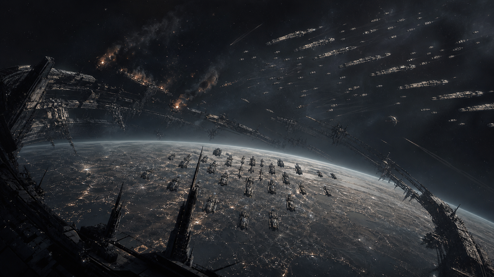
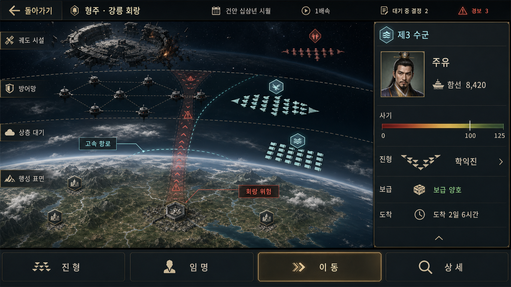

# UI 비주얼 샘플

게임 UI의 화면 구성과 분위기를 검토하기 위한 비주얼 샘플을 보관한다. 이 폴더의 이미지는
방향성 검증용이며, 별도 승인 없이 최종 게임 에셋으로 간주하지 않는다.

## 적벽 궤도전 — 구지 전투 키아트

| 항목 | 내용 |
|---|---|
| 파일 | `seonghanji-red-cliffs-guji-battle-key-art-16x9.png` |
| 용도 | 전투 화면·시나리오 선택·로딩 화면의 배경 및 UI 합성 방향 검토 |
| 형식 | PNG, 와이드 16:9 계열 |
| 제작 방식 | OpenAI 내장 이미지 생성 도구로 만든 AI 생성 이미지 |
| 상태 | UI 샘플 — 최종 게임 에셋 아님 |
| 생성일 | 2026-08-30 |

### 장면 의도

- 구지(옛 지구)를 화면 하단에 두고, 파괴된 궤도 시설이 좁은 전략 회랑을 형성한다.
- 우상단의 공격 함대는 정돈된 종대로 진입하고, 방어 함대는 회랑 부근에서 밀집 진형을 유지한다.
- 연소 중인 함선과 표류 잔해의 사슬로 화공과 보급 차단 이후 한쪽 진형이 붕괴하는 상황을 표현한다.
- 단일 영웅함보다 다수의 함선·호위함·항모·전자전함을 보여 주어 지휘 규모와 진형을 우선한다.

### 시각 방향

- 차가운 별빛과 창백한 행성 반사광을 기본으로 하고, 불길은 제한된 호박색으로만 사용한다.
- 과장된 우주전 스펙터클보다 역사적 비극, 군수 실패, 전략적 결과의 무게를 강조한다.
- 한국 역사 전쟁물의 절제된 감각을 성간 물류와 정치 전쟁의 이미지로 번역한다.

### UI 적용 메모

- 현재 이미지는 UI, 문자, 로고가 없는 깨끗한 배경 샘플이다.
- 주요 전투 정보는 행성과 함대 진형을 가리지 않도록 좌상단 또는 하단 가장자리의 안전 영역에 배치한다.
- 밝은 궤도선과 함선 밀도가 높은 중앙부에는 작은 본문 텍스트를 올리지 않는다.
- 실제 화면 적용 시 1600×900 기준 크롭과 명도 대비를 별도로 검증한다.

### 금지 요소

외계 문명, 행성 파괴 병기, 초대형 광선, 과도한 네온, 애니메이션풍 메카,
중국 궁궐풍 판타지 장식, 기존 프랜차이즈를 연상시키는 함선 디자인을 사용하지 않는다.

### 출처와 관리

원본 생성본은 `output/imagegen/orbital-red-cliffs-guji-key-art.png`에 보존되어 있다.
AI 생성물의 상업 이용 및 출시 고지 여부는 최종 채택 시
`docs/07-production/asset-ledger.md`의 절차에 따라 다시 확인하고 기록한다.

---

## 형주성역 — 전략 관계도 UI

| 항목 | 내용 |
|---|---|
| 파일 | `seonghanji-mandate-jingzhou-sanctuary-1600x900.png` |
| 화면 | `SC-L2` 성역 뷰 — 형주성역 |
| 용도 | Android 태블릿 가로형 UI의 레이아웃·정보 위계·시각 언어 검토 |
| 형식 | PNG, 1600×900 px (16:9) |
| 제작 방식 | OpenAI 내장 이미지 생성 도구로 만든 AI 생성 이미지 |
| 상태 | UI 샘플 — 최종 게임 에셋 아님 |
| 생성일 | 2026-08-30 |
| SHA-256 | `366CEAF674E1FD839167F7E63E537A44FB43FCCC5497701C45428390409F40A7` |
| 구현 정본 | [`docs/06-tech/screens.md`](../../docs/06-tech/screens.md) §2 `SC-L2` |

### 화면 의도

평면 은하 지도 대신 형주성역 내부의 권역 관계와 항로를 한 화면에서 읽게 하는 전략 화면이다.
소유권, 보급로, 분쟁 회랑, 행정 수도, 권역별 관리 상태를 짧은 확인 동선 안에 배치한다.

- 상단 고정 바에 날짜, 시간 배속, 처리 대기 결정, 알림을 둔다.
- 중앙 관계도에 4개 권역과 일반 항로·고속 항로·회랑/관문·교전 구간을 표시한다.
- 형주 권역에는 행정 수도 표식과 작은 구지(옛 지구)를 배치한다.
- 하단의 세 권역 카드에는 국력, 전화, 안정, 개발여지, 직할/위임, 주둔 정보를 담는다.
- 아군은 비취색, 적군은 청색, 중립은 회색으로 구분하고 문양과 아이콘을 함께 사용한다.
- 행정 수도와 우선 정보에만 탁한 금색을 제한적으로 사용한다.

### 구현 메모

1. 관계도는 장식용 배경이 아니라 항로 종류와 차단 위험을 판단하는 주 조작 영역으로 삼는다.
2. 색상만으로 소유권과 경로를 구분하지 않는다. 문양, 선 종류, 아이콘, 상태 문구를 함께 제공한다.
3. 회랑과 관문은 굵은 적갈색 이중선, 고속 항로는 청록 실선, 일반 항로는 가는 청회색 선을 사용한다.
4. 구지는 형주성역의 중요한 대상이지만 권역 노드보다 크게 표현하지 않는다.
5. 하단 권역 카드는 선택·비교를 우선하고, 세부 조작은 하프 시트 또는 `SC-L3` 세부 뷰로 넘긴다.
6. 태블릿 터치 영역과 실제 글자 크기는 구현 화면에서 별도로 검증한다.

### 사용 범위와 주의

이 이미지는 구현 방향을 검토하기 위한 UI 샘플이며 게임 데이터나 화면 명세의 정본이 아니다.
수치, 세력 배치, 항로 연결, 카드 필드와 상호작용은 `screens.md`와 관련 시스템 문서를 따른다.

이미지 생성 과정에서 포함된 한글 자형, 아이콘, 숫자는 최종 UI 에셋으로 직접 사용하지 않는다.
실제 구현에서는 프로젝트의 Noto Sans KR 서체와 Godot UI 컴포넌트로 모든 텍스트와 조작 요소를
다시 구성한다. 배포 후보로 승격할 경우 AI 생성물 표기와 사용 기록을
[`docs/07-production/asset-ledger.md`](../../docs/07-production/asset-ledger.md)에 별도로 반영한다.

### 생성 요청 요약

> 삼국지에서 영감을 받은 성간 내전의 형주성역 화면. 어두운 군사 전략 인터페이스 위에
> 3~4개 권역 관계도, 위계가 다른 항로, 분쟁 회랑, 작은 구지, 세 장의 권역 카드를 배치한다.
> 화려한 네온이나 거대 행성 연출보다 보급선·주권·정치 압력을 읽기 쉽게 표현한다.

## 형주 강릉 회랑 — 지역 작전 상세 화면

| 항목 | 내용 |
|---|---|
| 파일 | `seonghanji-jingzhou-operational-detail-1600x900.png` |
| 용도 | 안드로이드 태블릿용 지역 상세 작전 화면의 구성 및 시각 방향 검토 |
| 형식 | PNG, 1600×900, 16:9 가로 화면 |
| 배경 지역 | 구지 행성권의 형주·강릉 회랑 |
| 제작 방식 | OpenAI 내장 이미지 생성 도구로 만든 AI 생성 `ui-mockup` |
| 상태 | UI 샘플 — 최종 게임 에셋 아님 |
| 생성일 | 2026-08-30 |

이 샘플은 시간이 흐르는 대전략 게임에서 플레이어가 한 지역의 전략적 의미와
선택 가능한 행동을 동시에 파악하는 화면을 제안한다. 장식적인 설명 대신 손상된
궤도 조선소, 방어망, 고속 항로와 위험 회랑의 공간 관계로 지역의 중요성을 전달한다.

### 화면 구성

#### 상단 상태 바

상단에는 날짜 `건안 십삼년 시월`, 배속, 대기 중인 결정과 경보를 고정 배치한다.
좌측의 `돌아가기`와 `형주 · 강릉 회랑`은 현재 화면의 위치와 이탈 동작을 명확히 한다.

#### 중앙 작전 지도

전장은 궤도 시설, 방어망, 상층 대기, 행성 표면의 네 층으로 구분한다. 함대는
개별 함선의 확대 묘사보다 쐐기진, 방진, 선형진, 학익진 같은 전술 도형과 정돈된
편대 실루엣으로 표시한다. 아군 두 함대는 옅은 청옥색, 적 함대는 채도를 낮춘
적색을 사용한다. 청록색 고속 항로와 녹슨 적색의 회랑 경고를 함께 보여 주어
이동 이점과 위험을 빠르게 비교하게 한다.

#### 선택 함대 상세 패널

우측 패널은 선택된 `제3 수군`의 상태를 다음과 같이 표시한다.

- 지휘관: 주유
- 함대 규모: 함선 8,420
- 사기: 0–125 범위, 100 기준선 강조
- 진형: 학익진
- 보급: 양호
- 도착 예정: 2일 6시간

지휘관 초상은 식별용 썸네일 크기로 제한한다. 사기 눈금의 100 기준선은 최대치
125와 구별해 전투 효율의 기준점으로 읽히도록 한다.

#### 하단 행동 바

`진형`, `임명`, `이동`, `상세`를 넓은 터치 영역으로 배치한다. 이동처럼 현재
맥락에서 중요한 행동만 옅은 금색으로 강조하고 나머지는 차분한 명도 대비를 유지한다.

### 시각 언어

| 항목 | 방향 |
|---|---|
| 기본 배경 | 짙은 차콜과 흑청색 |
| 주요 강조 | 탁한 금색 |
| 아군 및 빠른 경로 | 옅은 청옥색, 시안 |
| 적군 및 위험 회랑 | 저채도 적색, 녹슨 적색 |
| 본문 텍스트 | 차가운 회백색 |
| 서체 | Noto Sans KR 계열의 명료한 고딕체 |
| 분위기 | 정밀함, 긴장감, 절제된 정보 밀도 |

### UI 적용 메모

- 기준 해상도에서 주요 본문은 과도하게 작아지지 않게 하며 보조 라벨의 수를 제한한다.
- 네 작전 층은 배경 명도, 경계선과 지형 재질의 차이로 구별한다.
- 함대 표식은 색상에만 의존하지 않고 진형 실루엣과 진영 문양을 함께 사용한다.
- 우측 패널은 시간 진행 중에도 주요 수치가 한 번에 읽히는 고정 폭 구조를 권장한다.
- 하단 행동은 안드로이드 태블릿의 손가락 입력을 고려해 최소 터치 영역과 충분한 버튼 간격을 확보한다.
- 실제 구현에서는 모든 한국어 문구를 텍스트 컴포넌트로 다시 조판하고 접근성 대비를 검증한다.

### 생성 조건

한국 삼국시대와 과학소설이 결합된 대전략 게임의 형주 지역 상세 화면을 요청했다.
구지 행성의 네 작전 층, 손상된 궤도 조선소, 좁은 회랑, 아군 두 함대와 적 함대,
주유가 지휘하는 선택 함대 정보, 한국어 전용 태블릿 UI를 핵심 조건으로 사용했다.
조종석 시점, FPS HUD, 거대한 애니메이션 초상, 과도한 홀로그램, 마법 효과,
영문 UI와 워터마크는 제외했다.
