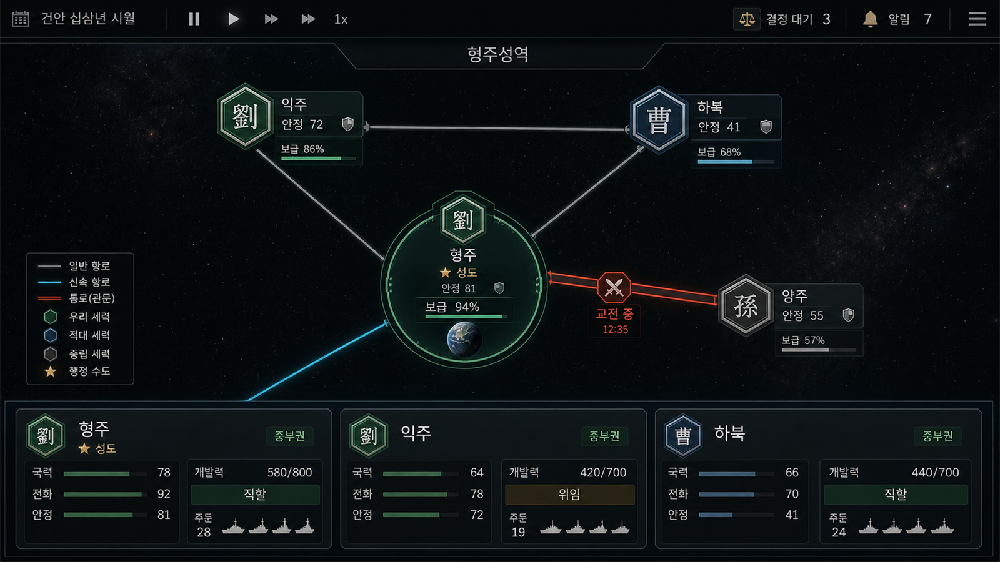

# 형주성역 UI 샘플

## 기본 정보

| 항목 | 내용 |
|---|---|
| 화면 | `SC-L2` 성역 뷰 — 형주성역 |
| 용도 | Android 태블릿 가로형 UI의 레이아웃·정보 위계·시각 언어 검토용 샘플 |
| 해상도 | 1600 × 900 px (16:9) |
| 형식 | PNG |
| 생성일 | 2026-08-30 |
| 생성 방식 | OpenAI 내장 이미지 생성 도구를 사용한 AI 생성 이미지 |
| SHA-256 | `366CEAF674E1FD839167F7E63E537A44FB43FCCC5497701C45428390409F40A7` |
| 구현 정본 | [`docs/06-tech/screens.md`](../../docs/06-tech/screens.md) §2 `SC-L2` |

## 화면 의도

평면 은하 지도 대신 형주성역 내부의 권역 관계와 항로를 한 화면에서 읽게 하는 전략 화면이다.
소유권, 보급로, 분쟁 회랑, 행정 수도, 권역별 관리 상태를 짧은 확인 동선 안에 배치하는 데
초점을 둔다.

- 상단 고정 바: 날짜, 시간 배속, 처리 대기 결정, 알림
- 중앙 관계도: 4개 권역과 일반 항로·고속 항로·회랑/관문·교전 구간
- 형주 권역: 행정 수도 표식과 작은 구지(옛 지구) 표시
- 하단 카드: 3개 권역의 국력, 전화, 안정, 개발여지, 직할/위임, 주둔 정보
- 시각 부호: 아군은 비취색, 적군은 청색, 중립은 회색으로 구분하고 문장·문양을 함께 사용
- 우선순위 색: 행정 수도와 핵심 정보에만 탁한 금색을 제한적으로 사용

## 구현 시 참고할 요소

1. 관계도는 장식용 배경이 아니라 항로 종류와 차단 위험을 판단하는 주 조작 영역으로 삼는다.
2. 색상만으로 소유권과 경로를 구분하지 않는다. 문양, 선 종류, 아이콘, 상태 문구를 함께 제공한다.
3. 회랑과 관문은 굵은 적갈색 이중선, 고속 항로는 청록 실선, 일반 항로는 가는 청회색 선을 사용한다.
4. 구지는 형주성역의 중요한 대상이지만 권역 노드보다 크게 표현하지 않는다.
5. 하단 권역 카드는 선택·비교가 먼저 보이고, 세부 조작은 하프 시트 또는 `SC-L3` 세부 뷰로 넘긴다.
6. 태블릿 터치 영역과 실제 글자 크기는 구현 화면에서 별도로 검증한다.

## 사용 범위와 주의

이 이미지는 구현 방향을 검토하기 위한 **UI 샘플**이며 게임 데이터나 화면 명세의 정본이 아니다.
수치, 세력 배치, 항로 연결, 카드 필드와 상호작용은 `screens.md` 및 시스템 문서를 따른다.

이미지 생성 과정에서 포함된 한글 자형, 아이콘, 숫자는 최종 UI 에셋으로 직접 사용하지 않는다.
실제 구현에서는 프로젝트의 Noto Sans KR 서체와 Godot UI 컴포넌트로 모든 텍스트와 조작 요소를
다시 구성해야 한다. 배포 후보로 승격할 경우 AI 생성물 표기와 사용 기록은
[`docs/07-production/asset-ledger.md`](../../docs/07-production/asset-ledger.md)에 별도로 반영한다.

## 생성 요청 요약

> 삼국지에서 영감을 받은 성간 내전의 형주성역 화면. 어두운 군사 전략 인터페이스 위에
> 3~4개 권역 관계도, 위계가 다른 항로, 분쟁 회랑, 작은 구지, 세 장의 권역 카드를 배치한다.
> 화려한 네온이나 거대 행성 연출보다 보급선·주권·정치 압력을 읽기 쉽게 표현한다.

