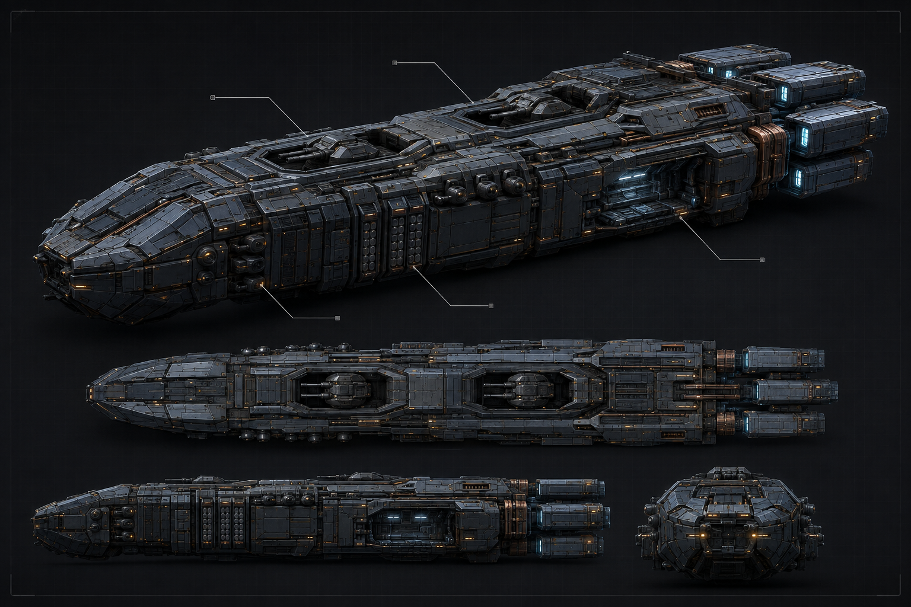

# 해무급 전열함 V3 — 외주 디자인·기술 명세서

> 상위: `docs/03-systems/ship-specs.md` §2.2·§3.1 · `docs/07-production/preproduction-ship3d-procurement.md` §1~§3 · `docs/07-production/visual-direction-guide.md` §2.3·§2.5·§4.3
> 작성일: **2026-09-06** · 상태: **발주 가능 초안** · 자산 ID: `MDL-001-HERO`
>
> 이 문서는 기존 `haemu-line-battleship-v1.md`의 품질 목표를 대체하는 납품 명세다. V1의 **240m** 표기는 폐기한다. 전열함의 정본 전장은 **750m**이며, 게임 수치·함급 역할은 이 문서가 바꾸지 않는다.

## 1. 발주 요약

해무급은 전열함(투함) 1척을 위한 영웅 자산이다. 플레이어가 근접 360° 관측했을 때 산업적으로 설득력 있고, 140척 항행 장면에서는 한 척의 기준함으로 읽혀야 한다. 특정 게임·영화·실존 IP의 모델, 표면 문양, 부품 배치를 복제하지 않는다.

| 항목 | 확정 기준 |
|---|---|
| 함급·역할 | 전열함(투함) · ③ 교전의 기준 주력함 |
| 실제 전장 | 750m · Godot 1 단위 = 1m |
| 무장 근거 | 주포 광선포 16문 · 부포 24문 · 근접 방어 12기 · 미사일 48발/8 발사관 |
| 설계 언어 | 비대칭 정비성이 드러나는 산업 함선. 장식보다 장갑·열 배출·무장·정비 동선이 먼저 읽혀야 함 |
| 기준 방향 | Y-up, 전방 −Z, 원점 = 용골선 중앙. `+X` 우현, `−X` 좌현 |
| 기본 도장 | 청회색 세라믹 금속, 무광 방열판, 국소 열변색, 청백색 추진광, 절제된 호박색 항법등 |

## 2. 독자적 디자인 시트

외주자는 아래 5면 orthographic sheet(정면·좌현·우현·상면·하면·후면 중 최소 5면)를 먼저 제출한다. 재질을 끈 검정 실루엣 컷과 기능 콜아웃을 함께 낸다. 모델링은 이 시트의 서면 승인을 받은 뒤 시작한다.

초기 방향 시트: [`haemu-line-battleship-v3-design-sheet-r1.png`](../../assets/concepts/haemu-line-battleship-v3-design-sheet-r1.png). 이는 발주 전 형태 언어를 공유하기 위한 AI 생성 참고안이며, 정확한 정투상 도면·치수·모델링 원본을 대체하지 않는다.

| 구역 | 필수 형태·기능 | 금지 |
|---|---|---|
| 선수 | 낮고 넓은 **쐐기형 센서 장갑**. 중앙에서 약간 좌현으로 치우친 관측 슬릿과 전방 방열 절개 | 평면 삼각형 한 장, 둥근 함교 돔, 중앙 아일랜드 탑 |
| 중앙 용골 | 계단식 장갑 척추와 4개 구획의 주포 열. 장갑 판 사이에 정비 접근부가 읽혀야 함 | 균일한 greeble, 사방 대칭 복제 |
| 좌현 | 주포·미사일 셀 중심의 전투 면. 포곽의 재장전/방열 구조를 노출 | 다른 IP의 포탑 실루엣 복제 |
| 우현 | 비대칭 정비 베이, 센서 붐, 드론/작업정 회수면. 좌현과 기능적으로 달라야 함 | 단순 장식 패널로만 비대칭 흉내 |
| 선미 | 서로 떨어진 **엔진 4기**와 각 엔진의 방열·자세제어 구조. 정면에서 본 엔진 배열도 식별 가능 | 거대한 단일 원형 엔진, 과도한 플룸 |

필수 콜아웃: 주포 16문, 부포 24문, 근접 방어 12기, 미사일 발사관 8개, 작업정/정비 베이, 센서 배열, 방열판, 엔진 4기. 숫자 표기는 시트에서만 하고 선체에는 함번·문장·고유명사를 굽지 않는다.

### 2.1 V1 콘셉트 기준선 — 2026-09-06

위 시트는 Blender 모델링에 들어가기 위한 **형태·재질 기준선**이다. 이미지 안의 작은
마커는 가독성용 그래픽이며, 선체에 구운 텍스트나 게임 UI가 아니다. 모델러는 이미지의
미세 greeble을 복제하지 않고 아래의 식별 요소와 §3의 예산을 우선한다.

| 시트에서 잠그는 요소 | 모델링 해석 |
|---|---|
| 낮고 넓은 선수 | 좌우가 완전 대칭이 아닌 다층 선수 장갑과 중앙 센서 절개. 평면 삼각형 선체로 단순화하지 않는다. |
| 계단식 상부 척추 | 낮은 장갑 능선 안에 주포 바베트 4구획을 둔다. 독립된 고층 함교를 세우지 않는다. |
| 좌현 전투면 | 미사일 셀·부포·근접 방어를 반복 모듈로 배치하고 재장전/열배출 간극을 남긴다. |
| 우현 정비면 | 내부 리브가 보이는 회수 베이를 별도 공간으로 만든다. 좌현의 단순 미러링을 금지한다. |
| 분리 엔진 4기 | 각 엔진에 스트럿, 방열판, 자세 제어부, 청백 발광 노즐을 남긴다. LOD2까지 네 기의 간격을 보존한다. |
| 청회색·흑연·구리 | 선체는 청회색 세라믹 금속, 포곽/방열판은 무광 흑연, 열부는 국소 구리빛 변색. 발광은 청백 추진광과 절제된 호박색만 사용한다. |

**이미지의 역할:** 이 파일은 AI 생성 콘셉트 참고용이며 게임에 직접 표시하거나 3D
메시·텍스처로 변환하지 않는다. 최종 게임 자산의 원본·권리·텍스처·LOD 인수는 §3과
§5의 기준을 별도로 충족해야 한다.

### 2.2 내부 모델링 베이스 — 2026-09-06

| 산출물 | 용도 |
|---|---|
| `tools/blender/build_wei_haemu_standard_battleship_v1.py` | Blender 배치 생성 진입점. 기존 프로토타입을 덮어쓰지 않고 V1 이름으로 빌드한다. |
| `assets/models/ships/wei_haemu_standard_battleship_v1.blend` | 편집 가능한 Blender 원본. |
| `assets/models/ships/wei_haemu_standard_battleship_lod0_v1.glb` | Godot에서 먼저 검수할 GLB. 732 메시, 87,824 triangles, 재질 9개인 게임용 상세 베이스다. |
| `out/fleet-reference-scene/wei-haemu-standard-battleship-v1.png` | Blender 렌더 검수 이미지. |

이 베이스는 선수·4기 엔진·주포·측면 장갑·우현 정비 베이를 실제 메시로 분리해 두었다.
정식 LOD0 인수 전에는 §3의 재질 슬롯 4개 이하와 70k–100k triangle 목표에 맞춰 병합·베이크·상세화를 수행한다.

## 3. 모델·재질 납품물

| 납품물 | 필수 기준 |
|---|---|
| 원본 | Blender `.blend` 원본, 외부 링크를 끊은 상태, 적용 전 modifier와 최종 export 컬렉션을 분리 |
| 게임 모델 | `haemu_line_ship_lod0.glb`~`lod3.glb`, glTF 2.0, 모든 텍스처 동봉. Godot 4.7에서 import 오류 0 |
| 하이폴리 | 베이크 가능한 원본. 게임 빌드에 넣지 않음 |
| UV | LOD0 UV0은 0–1 범위에서 겹침 없음. 데칼/손상용 UV1 또는 별도 데칼 메시. 이음은 눈에 띄는 선수·상부 능선에 두지 않음 |
| 재질 | 메탈릭-러프니스 PBR. 재질 슬롯은 선체/엔진 발광/데칼을 포함해 4개 이하. 투명 재질은 엔진·항법등만 |
| PBR 4K | `BaseColor`, `Normal`(OpenGL), `ORM`(R=AO, G=Roughness, B=Metallic), `Emissive` PNG 또는 TGA. LOD1은 2K, LOD2는 1K, LOD3은 512 또는 impostor |
| 분리 노드 | 포탑, 정비 도어, 미사일 셀 덮개, 엔진 플룸 기준점은 본 없는 별도 노드. 이름은 `turret_`, `bay_`, `missile_`, `engine_` 접두사 |
| 마스크·데칼 | 세력 색/문장용 단색 마스크와 현측·함수 데칼 평면 2개. 고유 로고·실존 문자·타사 문장 금지 |

### LOD 기준

| 단계 | 삼각형 | 사용처 | 화면 조건 |
|---|---:|---|---|
| LOD0 | 70k–100k | 단독 영웅 관측 | 2–6척 이하, 근접 360° |
| LOD1 | 20k–30k | 근거리 편대 | 최대 18척 |
| LOD2 | 3k–6k | 중거리 편대 | 최대 48척 |
| LOD3 | 300–800 또는 impostor | 원거리 군집 | `MultiMeshInstance3D` 대상 |

LOD 단계마다 실루엣, 엔진 4기, 선수 쐐기, 우현 정비 베이는 남아야 한다. LOD2에서 이 네 요소 중 하나라도 뭉개지면 재작업이다.

## 4. Godot 연결 계약

현재 관측 씬은 `app/views/fleet_voyage_3d.gd`다. PC 기본 렌더러는 Forward+이고, Android/iOS는 Compatibility 폴백을 유지한다. 실제 함선은 어느 렌더러에서도 표시되어야 하며, SSR·SSIL은 Forward+에서만 품질 향상으로 취급한다.

1. GLB를 `assets/models/ships/`에 넣고, LOD0 파일은 `haemu_line_ship_lod0_v2.glb`를 대체하기 전 별도 QA 경로에서 검수한다.
2. 상용 사용이 가능한 4K HDRI는 `assets/environments/hero_ship_reflection_4k.hdr`에 등록한다. 파일명·출처·라이선스·SHA-256은 `asset-ledger.md`에 기록한다.
3. 관측 씬은 AgX 톤매핑, 물리 카메라(ISO 100 · f/5.6 · 1/125초), 제한 Glow, SSAO를 사용한다. Forward+일 때만 SSR·SSIL을 켠다.
4. 영웅함은 최대 1척만 LOD0으로 표시한다. 나머지는 거리 기반 LOD 또는 `MultiMeshInstance3D`로 배치한다.

## 5. 검수와 권리

### 기술·시각 검수

- Godot 4.7 Forward+에서 import/boot 오류 0, 360° 회전·최소/최대 줌 촬영 통과.
- Compatibility에서도 누락 메시·검정 재질·발광 과포화가 없어야 한다.
- HDRI 조명에서 금속/도장/거칠기 차이가 읽히고, 정면·측면·후면에서 전후 방향이 2초 안에 판독되어야 한다.
- 50/140/300/500척 테스트에서 LOD 튐, 메모리 급증, 엔진·데칼 누락이 없어야 한다. 140척 기준 60 FPS(p95 16.67ms), 3D GPU 9ms 이하, CPU 5ms 이하를 목표로 기록한다.
- 독창성 검수: 레퍼런스 보드의 출처를 제출하고, 특정 게임·영화 함선을 직접 추적한 실루엣/파츠가 없음을 확인한다.

### 계약 문구에 포함할 권리

발주자는 전 세계, 영구, 취소 불가, 상업적 이용·수정·2차 저작물 제작·게임 빌드 내 배포 권리를 가진다. Blender 원본, GLB, 텍스처, 소스 파일을 모두 인도하며, 외부 플러그인·스톡·폰트·텍스처의 라이선스와 원본 재배포 제한을 파일 단위로 고지한다. 납품자는 제3자 IP를 복제하지 않았음을 보증한다.

## 6. 인수 체크리스트

- [ ] orthographic sheet와 기능 콜아웃 승인
- [ ] 독창성·참조 출처 검토 완료
- [ ] Blender 원본, GLB 4종, 하이폴리, PBR 세트, 노드 명명 수령
- [ ] UV/ORM/노멀/발광 채널 검사 완료
- [ ] Godot Forward+ 및 Compatibility 360° 검수 완료
- [ ] 50/140/300/500척 성능 기록 수령
- [ ] 상업 이용·수정·게임 내 배포 권리와 제3자 라이선스 증빙 수령
- [ ] `asset-ledger.md`에 파일별 SHA-256·출처·권리 기록

## 검토 포인트

| # | 쟁점 | 비고 |
|---|---|---|
| 1 | HDRI의 실제 구매/CC0 선정 | 라이선스 대장 등록 전에는 별 배경 폴백을 사용한다. 외부 반입은 별도 승인 범위다. |
| 2 | LOD 예산 실측 잠금 | 본 수치는 영웅 자산 발주 기준이며, 최종 전환 거리는 목표 PC·모바일에서 측정 후 잠근다. |
| 3 | V1 240m 표기 | V3가 750m 정본을 명시했으나, 기존 V1 파일은 역사 기록으로 남는다. |

## 미작성 항목

- [ ] 외주자 선정 후 견적·일정·마일스톤 기입
- [ ] HDRI 후보의 파일 단위 라이선스·SHA-256 대장 등록
- [x] 승인 대상 디자인 시트 V1 연결 — `assets/concepts/wei-haemu-standard-battleship-v1.png` (2026-09-06). 최종 승인과 외주 납품 검수는 별도.
- [ ] 실측 FPS/메모리 표를 인수 기록으로 추가
